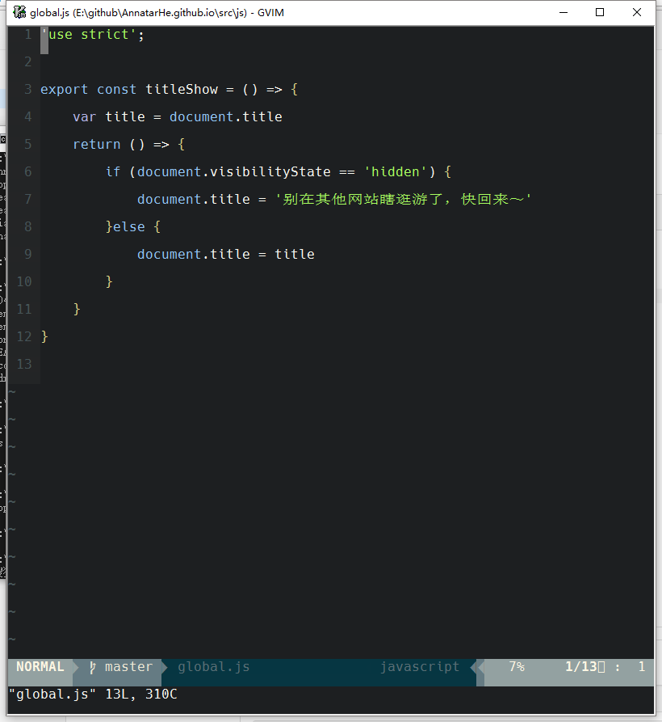

#Sumary
This is AnnatarHe's Vim configure.

#  short keys

`;t` is toggle NERDTree,

`;cc` is comment the code that was blcoked.

`;cu` is uncomment the code

`;[space]` is unhighlight the result be search.

Screenshot:

#License
MIT   
If you like it.Take it!!!
