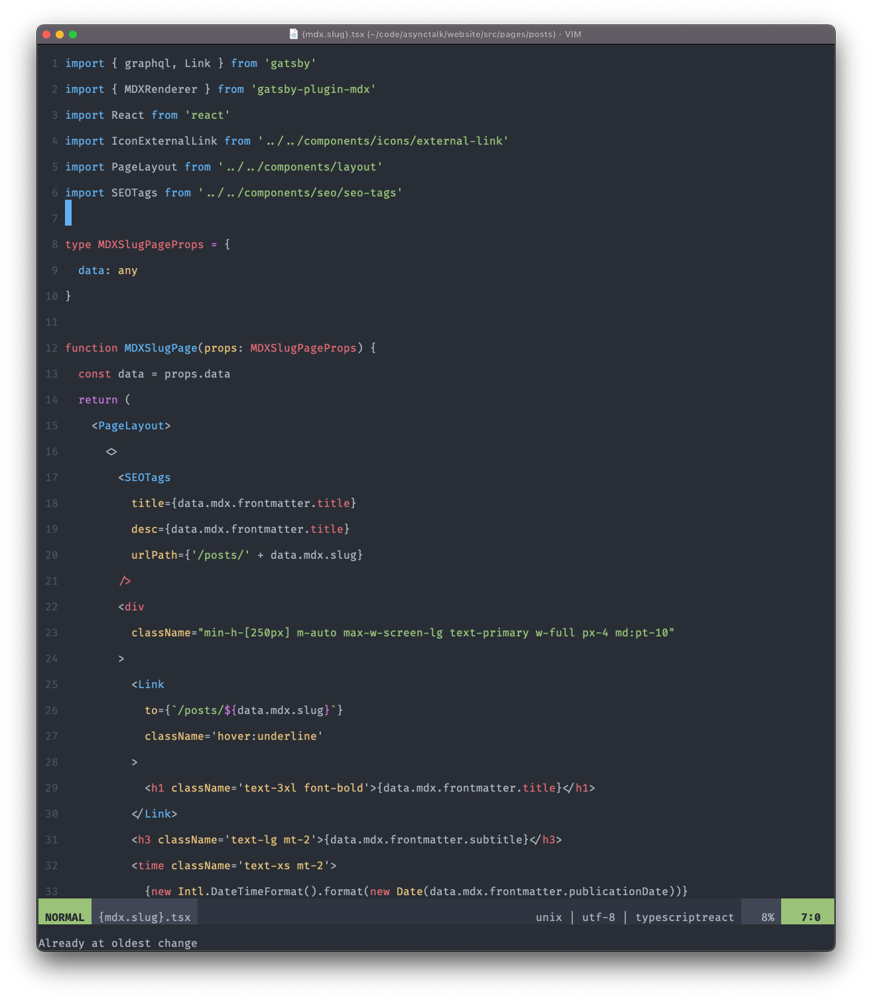

## Vim 配置

这是我个人的 vim 配置文件。

## 其他

推荐安装 [Fria Code Font](https://github.com/tonsky/FiraCode) 作为编程字体。它有很多漂亮的符号

主题样式是 Dracula Theme

## short keys

`;t` 展开/关闭 目录,

`;cc` 注释选中的文字.

`;cu` 取消注释

`;[space]` 搜索关键字取消高亮.

`;y` 复制进入系统剪切板

`;p` 从系统剪贴板粘贴

Screenshot:

